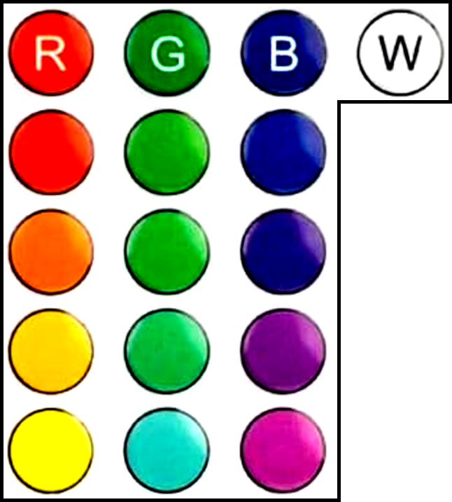
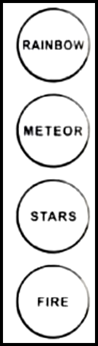
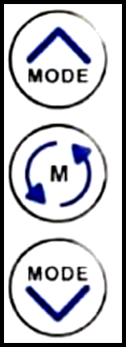
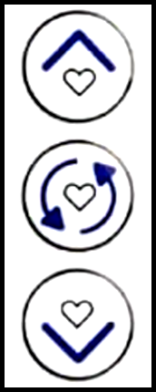
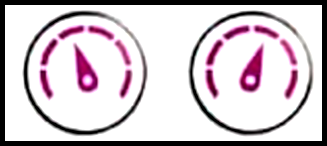

# Remote Control Button Reference

This document describes the functions of each button on the LED controller remote. Button sections are illustrated with images for clarity.

---

## Power Buttons

| Button     | Function (Code Name) | IR Code | Description          |
| ---------- | -------------------- | ------- | -------------------- |
| Green (ON) | IR_ON                | 0x5c    | Power on the device  |
| Red (OFF)  | IR_OFF               | 0x40    | Power off the device |

---

## Color Selection Buttons

| Button        | Function (Code Name) | IR Code | Description                                                                                                           |
| ------------- | -------------------- | ------- | --------------------------------------------------------------------------------------------------------------------- |
| Red           | IR_R1                | 0x58    | Set color: Red. When color change mode is active, changes the alternate color for the current animation.           |
| Orange        | IR_R2                | 0x54    | Set color: Orange. When color change mode is active, changes the alternate color for the current animation.        |
| Orange-Yellow | IR_R3                | 0x50    | Set color: Orange-Yellow. When color change mode is active, changes the alternate color for the current animation. |
| Yellow-Orange | IR_R4                | 0x1c    | Set color: Yellow-Orange. When color change mode is active, changes the alternate color for the current animation. |
| Yellow        | IR_R5                | 0x18    | Set color: Yellow. When color change mode is active, changes the alternate color for the current animation.        |
| Green         | IR_G1                | 0x59    | Set color: Green. When color change mode is active, changes the alternate color for the current animation.         |
| Light Green   | IR_G2                | 0x55    | Set color: Light Green. When color change mode is active, changes the alternate color for the current animation.   |
| Aqua          | IR_G3                | 0x51    | Set color: Aqua. When color change mode is active, changes the alternate color for the current animation.          |
| Teal          | IR_G4                | 0x1d    | Set color: Teal. When color change mode is active, changes the alternate color for the current animation.          |
| Cyan          | IR_G5                | 0x19    | Set color: Cyan. When color change mode is active, changes the alternate color for the current animation.          |
| Blue          | IR_B1                | 0x45    | Set color: Blue. When color change mode is active, changes the alternate color for the current animation.          |
| Indigo        | IR_B2                | 0x49    | Set color: Indigo. When color change mode is active, changes the alternate color for the current animation.        |
| Violet        | IR_B3                | 0x4d    | Set color: Violet. When color change mode is active, changes the alternate color for the current animation.        |
| Purple        | IR_B4                | 0x1e    | Set color: Purple. When color change mode is active, changes the alternate color for the current animation.        |
| Magenta       | IR_B5                | 0x1a    | Set color: Magenta. When color change mode is active, changes the alternate color for the current animation.       |
| White         | IR_W                 | 0x44    | Set color: White. When color change mode is active, changes the alternate color for the current animation.         |

---

## Preset Animation Buttons

| Button  | Function (Code Name) | IR Code | Description                |
| ------- | -------------------- | ------- | -------------------------- |
| Rainbow | IR_RAINBOW           | 0x48    | Activate rainbow animation |
| Meteor  | IR_METEOR            | 0x4c    | Activate meteor animation  |
| Stars   | IR_STARS             | 0x1f    | Activate stars animation   |
| Fire    | IR_FIRE              | 0x1b    | Activate fire animation    |

---

## Animation Control Buttons

| Button       | Function (Code Name) | IR Code | Description                        |
| ------------ | -------------------- | ------- | ---------------------------------- |
| Mode Up      | IR_MODE_UP           | 0x14    | Next animation mode                |
| Mode Shuffle | IR_RAND_SHUF         | 0x10    | Shuffle all animations (randomize) |
| Mode Down    | IR_MODE_DOWN         | 0x0c    | Previous animation mode            |

---

## Favorite Buttons

| Button      | Function (Code Name) | IR Code | Description                                                                                                                    |
| ----------- | -------------------- | ------- | ------------------------------------------------------------------------------------------------------------------------------ |
| Fav Up      | IR_FAV_UP            | 0x15    | Next favorite. When color select mode is active, saves the current animation as a favorite (unless it's in a shuffle mode). |
| Fav Shuffle | IR_FAV_SHUF          | 0x11    | Shuffle favorite animations                                                                                                    |
| Fav Down    | IR_FAV_DOWN          | 0x0d    | Previous favorite. When color select mode is active, removes the current animation from favorites.                          |

---

## Animation Speed Buttons

| Button     | Function (Code Name) | IR Code | Description              |
| ---------- | -------------------- | ------- | ------------------------ |
| Speed Up   | IR_SPEED_UP          | 0x17    | Increase animation speed |
| Speed Down | IR_SPEED_DOWN        | 0x16    | Decrease animation speed |

---

## Animation Length Buttons

| Button      | Function (Code Name) | IR Code | Description               |
| ----------- | -------------------- | ------- | ------------------------- |
| Length Up   | IR_LENGTH_UP         | 0x0f    | Increase animation length |
| Length Down | IR_LENGTH_DOWN       | 0x0e    | Decrease animation length |

---

## Brightness Buttons

| Button      | Function (Code Name) | IR Code | Description         |
| ----------- | -------------------- | ------- | ------------------- |
| Bright Up   | IR_BRIGHT_UP         | 0x13    | Increase brightness |
| Bright Down | IR_BRIGHT_DOWN       | 0x12    | Decrease brightness |

---

## Music Buttons

| Button        | Function (Code Name) | IR Code | Description              |
| ------------- | -------------------- | ------- | ------------------------ |
| Music Up      | IR_MUSIC_UP          | 0x09    | Next music mode          |
| Music Down    | IR_MUSIC_DOWN        | 0x08    | Previous music mode      |
| Music Shuffle | IR_MUSIC_SHUF        | 0x0a    | Shuffle music animations |

---

## Color Select Mode Button

| Button  | Function (Code Name) | IR Code | Description                                                                                                                                                                   |
| ------- | -------------------- | ------- | ----------------------------------------------------------------------------------------------------------------------------------------------------------------------------- |
| Dropper | IR_CHANGE_COLOR      | 0x0b    | Enter/exit color change mode. When active, pressing Fav Up saves the current animation as a favorite (unless it's a shuffle mode), and Fav Down removes it from favorites. |

---
